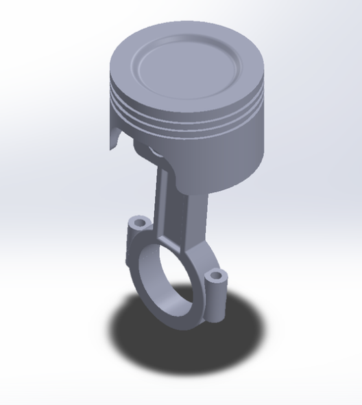
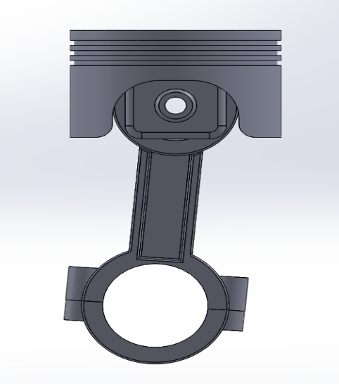
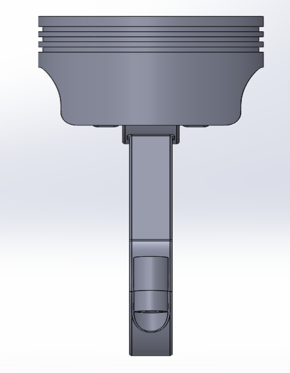

# Piston Assembly of a V6 Engine

> **Manufacturing Project | ME F214 | BITS Pilani**  
> Section P2 · Group 3 · Group Leader: Kaartik R Pai  
> Department of Mechanical Engineering, BITS Pilani, Pilani Campus

Design and physical manufacture of all components of a V6 piston assembly — piston head, connecting rod, rod cap, and wrist pin — from aluminium alloy billets using **CNC and manual machining operations**, followed by full assembly and inspection.


---

## Abstract

The piston assembly of a V6 engine is a critical sub-system responsible for converting the explosive force of the fuel-air combustion cycle into mechanical rotational motion via the crankshaft. This project covers the complete design-to-manufacture lifecycle of a single-cylinder piston assembly — comprising four distinct components: piston head, connecting rod, rod cap, and wrist pin — entirely fabricated from aluminium alloy.

CAD models were designed in **SolidWorks** and manufacturing was executed across the BITS Pilani workshop facilities using a combination of **CNC Lathe**, **CNC Mill**, **Manual Lathe**, and **Manual Milling** operations. The project follows a structured 4-phase work plan across 12 weeks covering material preparation, manual machining, CNC precision machining, and final assembly with dimensional inspection.

**Keywords:** Piston assembly · V6 engine · CNC machining · Manual lathe · Aluminium alloy · SolidWorks · Manufacturing process planning

---

## Team

| Role | Member |
|------|--------|
| **Group Leader** | Kaartik R Pai |
| Member | Ayush Sharma |
| Member | Rhythm Garg |
| Member | Rudraksh Singhal |
| Member | Thilak S |
| Member | C S Srivibhav |
| Member | Aditya Raj |
| Member | Raghav Goyal |
| Member | Shreyank Maheshwari |
| Member | Uditi Gupta |

---

## CAD Design — SolidWorks Models

All components were designed in SolidWorks prior to manufacturing. The assembly was validated across four standard orthographic views and one isometric view.



**Figure 1.** Isometric view of the complete piston assembly showing the piston head, connecting rod, rod cap, and wrist pin in assembled configuration. The crown grooves, skirt geometry, and big-end bore are clearly visible. Modelled in SolidWorks.

---



**Figure 2.** Front view of the piston assembly showing the wrist pin bore on the underside of the piston head, the full length of the connecting rod, and the big-end rod cap. This view was used to verify rod length and bore alignment dimensions.

---



**Figure 3.** Side view of the piston assembly confirming the connecting rod cross-section profile, the piston skirt length, and the rod cap split-line geometry. This view was critical for validating the manual milling stock removal plan for the connecting rod.

---


**Figure 4.** Top view of the piston head showing the circular crown surface and the concentric ring groove geometry machined by CNC lathe. This view was used to set the turning toolpath for crown facing and groove cutting operations.

---

## Components & Bill of Materials

| S.No. | Component | Material | Dimensions | Qty |
|-------|-----------|----------|------------|-----|
| 1 | Piston Rod (Connecting Rod) | Aluminium Alloy | L = 220 mm · B = 130 mm · H = 50 mm | 1 |
| 2 | Piston Pin (Wrist Pin) | Aluminium | L = 90 mm · Ø = 40 mm | 1 |
| 3 | Piston Rod Cap | Aluminium | L = 120 mm · B = 130 mm · H = 50 mm | 1 |
| 4 | Piston Head | Aluminium | Ø = 150 mm · H = 100 mm | 1 |

---

## Component Functionality

**Piston Head**
Converts the explosive force of the fuel-air mixture into linear reciprocating motion. The crown grooves seat the piston rings which seal the combustion chamber and prevent combustion gas blow-by into the crankcase. The skirt cutouts reduce reciprocating mass while maintaining structural rigidity.

**Connecting Rod (Piston Rod)**
Transmits the reciprocating motion of the piston to the crankshaft, converting linear motion into rotational energy. The small end connects to the wrist pin and the big end connects to the crankshaft journal via the rod cap.

**Rod Cap**
Bolts to the big end of the connecting rod to clamp around the crankshaft journal. Split from the connecting rod using a slitting saw after milling, ensuring a matched mating surface for precise journal clearance.

**Wrist Pin (Piston Pin)**
Connects the piston head to the small end of the connecting rod, acting as the pivot point for the angular motion of the connecting rod relative to the piston. Its cylindrical geometry makes it ideal for manual lathe manufacture.

---

## Manufacturing Process Plan

### Workflow Summary

| Component | Machine | Key Operations |
|-----------|---------|---------------|
| Piston Head | CNC Lathe + CNC Mill | OD turning · Crown facing · Ring groove cutting · Skirt cutouts · Wrist pin bore |
| Connecting Rod | Manual Mill + Manual Lathe | Flat surface milling · Stock removal · Small/big end bore drilling and reaming |
| Rod Cap | Manual Mill | Shaping · Bolt hole drilling · Splitting from connecting rod |
| Wrist Pin | Manual Lathe | OD turning to size · Parting to length · Edge chamfering |

---

### 1. Piston Head — CNC Lathe & CNC Mill

The piston head is the most geometrically complex component and demands the highest dimensional precision across crown flatness, ring groove depth/width, skirt OD, and wrist pin bore concentricity. CNC machining is mandatory.

**CNC Lathe operations:**
- Turn the outer diameter of the piston skirt to final dimension
- Face the crown to achieve flatness
- Machine the ring grooves on the crown to precise depth and width

**CNC Mill operations:**
- Create weight-reduction cutouts on the piston skirt
- Drill and finish the wrist pin holes to tolerance

**Tools:** Turning tools (OD and crown) · End mills (grooves and cutouts) · Drill bits / boring bars (wrist pin bore)

---

### 2. Connecting Rod — Manual Mill & Manual Lathe

The connecting rod has simpler geometry that can be roughed on manual machines before CNC finishing of mating surfaces.

**Manual Mill operations:**
- Mill flat surfaces of the connecting rod blank
- Rough out excess material to establish basic I-beam profile

**Manual Lathe operations:**
- Drill and bore the small end (wrist pin) hole
- Drill and bore the big end (crankshaft) hole

**CNC Mill (finishing):**
- Finish curved transitions and mating surfaces of the big-end bore

**Tools:** End mills (shaping) · Drill bits and reamers (holes) · Ball-end mills (transitions)

---

### 3. Rod Cap — Manual Mill

The rod cap has a straightforward geometry fully achievable on a manual milling machine.

**Manual Mill operations:**
- Mill the rod cap blank to shape from aluminium block
- Drill bolt holes using milling machine or drill press
- Split the cap from the connecting rod using a slitting saw or hacksaw

**Tools:** End mills (shaping) · Drill bits (bolt holes) · Slitting saw / hacksaw

---

### 4. Wrist Pin — Manual Lathe

The wrist pin is a simple cylindrical component — ideal for manual lathe operations.

**Manual Lathe operations:**
- Turn the outer diameter to final size
- Part to length using a parting tool
- Chamfer both edges for smooth assembly insertion

**Tools:** Turning tools (OD) · Parting tools (length)

---

## Week-by-Week Work Plan

| Phase | Week 1 | Week 2 | Week 3 |
|-------|--------|--------|--------|
| **Phase 1 — Material Preparation** | Cut raw aluminium alloy to size (band saw) | Rough shaping of piston head, connecting rod, rod cap (manual mill + lathe) | Drill pilot holes for wrist pin bore and connecting rod ends |
| **Phase 2 — Manual Machining** | Manual lathe — refine connecting rod small/big end dimensions | Mill rod cap to shape; separate from connecting rod | Drill bolt holes in rod cap and connecting rod; verify alignment |
| **Phase 3 — CNC Machining** | CNC lathe — machine piston head (crown grooves, skirt, wrist pin bore) | CNC mill — weight reduction cutouts on piston skirt | CNC mill — finish mating surfaces of rod cap and connecting rod |
| **Phase 4 — Assembly & Inspection** | Assemble wrist pin into bore; connect to small end of connecting rod | Attach rod cap to connecting rod using bolts; inspect alignment | Final dimensional inspection of all components; tolerance verification |

---

## Workshop Facilities & Instructors

| S.No. | Lab | Instructor(s) |
|-------|-----|--------------|
| 1 | Metal Cutting Shop | Mr. Vinod Kumar · Mr. Rakesh Kumar |
| 2 | Forming Shop | Mr. Sukhwant Singh · Mr. Rajendra Kumar |
| 3 | Welding Shop | Mr. Harpreet Singh · Mr. Om Prakash |
| 4 | Foundry Shop | Mr. Ishwar Singh |
| 5 | Lathe Shop | Mr. Rajesh Kumar Tanwar |
| 6 | Shaper, Milling & Grinding Shop | Mr. Raj Kumar Saini |

**Manufacturing processes used (minimum two):** CNC & Manual Lathe · CNC & Manual Milling

---

## V6 Engine Application Context

The piston assembly manufactured in this project is representative of those used in **V6 internal combustion engines**, which are widely deployed in mid-size automotive platforms due to their balance of power output and packaging efficiency.

**Why V6:**
- Compact transverse layout — ideal for front-wheel drive vehicles
- Balanced power delivery from six cylinders at 60° or 90° bank angles
- Better fuel efficiency than V8 with higher performance than inline-4

**Piston assembly role in the engine cycle:**
1. **Intake stroke** — piston descends, intake valve opens, fuel-air mixture enters
2. **Compression stroke** — piston ascends, mixture compressed to ~10:1 ratio
3. **Power stroke** — spark ignition drives piston down; connecting rod transmits force to crankshaft
4. **Exhaust stroke** — piston ascends, exhaust valve opens, combustion gases expelled

**Material rationale — Aluminium alloy:** Selected for its high strength-to-weight ratio, machinability, and thermal conductivity, enabling rapid heat dissipation from the piston crown during the combustion cycle.

---

## Repository Structure

```
piston-assembly-v6/
├── cad/
│   └── piston_assembly.SLDASM          # SolidWorks assembly file
├── figures/
│   ├── isometric_view.png              # Fig 1 — Isometric view of full assembly
│   ├── front_view.png                  # Fig 2 — Front view showing rod and cap
│   ├── side_view.png                   # Fig 3 — Side view showing rod cross-section
│   └── top_view.png                    # Fig 4 — Top view of piston head crown
├── report/
│   └── Manu_pro_project.docx           # Full project report with BOM and process plan
└── README.md
```

---

**Course:** ME F214 — Manufacturing Processes  
**Section / Group:** P2 / G3  
**Institution:** Department of Mechanical Engineering, BITS Pilani, Pilani Campus  
**Group Leader:** Kaartik R Pai | **Members:** Ayush Sharma · Rhythm Garg · Rudraksh Singhal · Thilak S · C S Srivibhav · Aditya Raj · Raghav Goyal · Shreyank Maheshwari · Uditi Gupta
